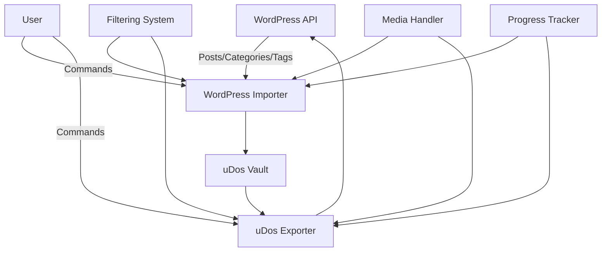

# 📥📤 A2 Phase 3 - Import/Export System Implementation Plan

**Phase:** A2 Phase 3  
**Duration:** 1 Week  
**Status:** PLANNING  
**Dependencies:** A2 Phase 1 & 2 Completed

## 🎯 Phase 3 Overview

Phase 3 focuses on implementing the **Import/Export System** that builds upon the WordPress API client (Phase 1) and sync engine (Phase 2). This phase will enable actual data transfer between WordPress and uDos, completing the core WordPress integration functionality.

## 🏗️ Architecture Design

### System Components



### Core Components

#### 1. **WordPress Importer** 📥
**Location:** `core/src/import/wordpress-importer.ts`

**Responsibilities:**
- Fetch posts from WordPress API
- Transform WordPress posts to uDos notes
- Preserve metadata and relationships
- Handle media attachments
- Apply filtering and selection criteria
- Track progress and report results

#### 2. **uDos Exporter** 📤
**Location:** `core/src/export/udos-exporter.ts`

**Responsibilities:**
- Fetch notes from uDos vault
- Transform uDos notes to WordPress posts
- Preserve metadata and relationships
- Handle media attachments
- Apply filtering and selection criteria
- Track progress and report results

#### 3. **Filtering System** 🔍
**Location:** `core/src/import-export/filter.ts`

**Responsibilities:**
- Date-based filtering (since, before)
- Status-based filtering (draft, published, etc.)
- Category/tag filtering
- Author filtering
- Custom query filtering

#### 4. **Media Handler** 🖼️
**Location:** `core/src/import-export/media.ts`

**Responsibilities:**
- Download media from WordPress
- Upload media to WordPress
- Handle media metadata
- Manage media relationships
- Error handling and fallbacks

#### 5. **Progress Tracker** 📊
**Location:** `core/src/import-export/progress.ts`

**Responsibilities:**
- Track import/export progress
- Calculate completion percentages
- Estimate time remaining
- Report statistics
- Handle progress persistence

### Data Flow

```
WordPress → WordPressImporter → Filtering → Media Handling → uDos Vault
uDos Vault → uDosExporter → Filtering → Media Handling → WordPress
```

## 📋 Implementation Roadmap

### Day 1: Architecture & Core Interfaces

**Tasks:**
- [ ] Create import/export directory structure
- [ ] Define core interfaces and types
- [ ] Implement base classes
- [ ] Set up error handling framework

**Deliverables:**
```bash
core/src/import/
core/src/export/
core/src/import-export/
```

### Day 2: WordPress Importer

**Tasks:**
- [ ] Implement WordPress post fetcher
- [ ] Build WordPress-to-uDos transformation
- [ ] Add metadata preservation
- [ ] Implement basic error handling

**Deliverables:**
```bash
udo wp import --all
udo wp import --since "2023-01-01"
```

### Day 3: uDos Exporter

**Tasks:**
- [ ] Implement uDos note fetcher
- [ ] Build uDos-to-WordPress transformation
- [ ] Add metadata preservation
- [ ] Implement basic error handling

**Deliverables:**
```bash
udo wp export --all
udo wp export --status draft
```

### Day 4: Filtering System & Media Handling

**Tasks:**
- [ ] Implement date-based filtering
- [ ] Add status-based filtering
- [ ] Implement category/tag filtering
- [ ] Build media download functionality
- [ ] Build media upload functionality

**Deliverables:**
```bash
udo wp import --category news --since "2023-01-01"
udo wp export --tag featured --include-media
```

### Day 5: Progress Tracking & CLI Integration

**Tasks:**
- [ ] Implement progress tracking
- [ ] Add progress reporting
- [ ] Integrate with CLI
- [ ] Add help and documentation

**Deliverables:**
```bash
udo wp import --progress
udo wp export --verbose
```

### Day 6: Testing & Validation

**Tasks:**
- [ ] Create test data sets
- [ ] Implement unit tests
- [ ] Add integration tests
- [ ] Validate error handling
- [ ] Test edge cases

**Deliverables:**
```bash
npm test --import-export
udo wp import --test
udo wp export --validate
```

### Day 7: Documentation & Polish

**Tasks:**
- [ ] Update command documentation
- [ ] Add examples and tutorials
- [ ] Create user guides
- [ ] Add API documentation
- [ ] Final testing and bug fixing

**Deliverables:**
```bash
# Complete documentation set
# User guides and examples
# API reference
```

## 🔧 Technical Implementation Details

### WordPress Importer Interface

```typescript
interface WordPressImporter {
  importPosts(options: ImportOptions): Promise<ImportResult>;
  importPost(id: number): Promise<UdosNote>;
  importByCategory(category: string, options: ImportOptions): Promise<ImportResult>;
  importByAuthor(author: number, options: ImportOptions): Promise<ImportResult>;
  getImportStats(): Promise<ImportStatistics>;
}

interface ImportOptions {
  since?: string;
  before?: string;
  status?: string[];
  categories?: number[];
  tags?: number[];
  limit?: number;
  includeMedia?: boolean;
  dryRun?: boolean;
}

interface ImportResult {
  success: boolean;
  imported: number;
  skipped: number;
  errors: string[];
  durationMs: number;
  statistics: ImportStatistics;
}
```

### uDos Exporter Interface

```typescript
interface UdosExporter {
  exportNotes(options: ExportOptions): Promise<ExportResult>;
  exportNote(id: string): Promise<WordPressPost>;
  exportByTag(tag: string, options: ExportOptions): Promise<ExportResult>;
  exportByCategory(category: string, options: ExportOptions): Promise<ExportResult>;
  getExportStats(): Promise<ExportStatistics>;
}

interface ExportOptions {
  since?: string;
  before?: string;
  status?: string[];
  tags?: string[];
  categories?: string[];
  limit?: number;
  includeMedia?: boolean;
  dryRun?: boolean;
}

interface ExportResult {
  success: boolean;
  exported: number;
  skipped: number;
  errors: string[];
  durationMs: number;
  statistics: ExportStatistics;
}
```

### Filtering System Interface

```typescript
interface FilterSystem {
  applyFilters(items: any[], filters: FilterCriteria): any[];
  createDateFilter(since?: string, before?: string): (item: any) => boolean;
  createStatusFilter(status: string[]): (item: any) => boolean;
  createCategoryFilter(categories: number[]): (item: any) => boolean;
  createTagFilter(tags: number[]): (item: any) => boolean;
  createCustomFilter(query: string): (item: any) => boolean;
}

interface FilterCriteria {
  date?: { since?: string; before?: string };
  status?: string[];
  categories?: number[];
  tags?: number[];
  custom?: string;
}
```

### Media Handler Interface

```typescript
interface MediaHandler {
  downloadMedia(url: string, postId: number): Promise<MediaDownloadResult>;
  uploadMedia(filePath: string, postId: number): Promise<MediaUploadResult>;
  processMediaInContent(content: string): Promise<string>;
  getMediaMetadata(mediaId: number): Promise<WordPressMedia>;
  cleanupOrphanedMedia(): Promise<CleanupResult>;
}

interface MediaDownloadResult {
  success: boolean;
  localPath?: string;
  mediaId?: number;
  error?: string;
}

interface MediaUploadResult {
  success: boolean;
  mediaId?: number;
  url?: string;
  error?: string;
}
```

### Progress Tracker Interface

```typescript
interface ProgressTracker {
  startTracking(total: number, operation: string): void;
  updateProgress(completed: number): void;
  completeTracking(): ProgressSummary;
  getCurrentProgress(): ProgressStatus;
  logProgress(message: string): void;
}

interface ProgressStatus {
  operation: string;
  total: number;
  completed: number;
  percentage: number;
  estimatedTimeRemaining?: number;
  startedAt: string;
}

interface ProgressSummary {
  operation: string;
  total: number;
  completed: number;
  success: number;
  failed: number;
  durationMs: number;
  startedAt: string;
  completedAt: string;
}
```

## 📊 Success Criteria

### Functional Requirements
- [ ] WordPress post importer with metadata preservation
- [ ] uDos note exporter with formatting options
- [ ] Date-based filtering (since, before)
- [ ] Status-based filtering (draft, published, etc.)
- [ ] Category and tag filtering
- [ ] Media attachment handling (download/upload)
- [ ] Progress tracking and reporting
- [ ] Comprehensive error handling
- [ ] Dry-run mode for safety
- [ ] CLI command integration

### Quality Requirements
- [ ] Comprehensive test coverage (>90%)
- [ ] TypeScript type safety
- [ ] Performance optimization
- [ ] Memory efficiency
- [ ] Security considerations
- [ ] User-friendly error messages
- [ ] Complete documentation
- [ ] Examples and tutorials

### Delivery Requirements
- [ ] All import/export tests passing
- [ ] User documentation complete
- [ ] API documentation complete
- [ ] Example configurations provided
- [ ] Migration guides from A1
- [ ] CLI help and usage guides

## 🎯 Migration Path from A2 Phase 2

### Enhancements to Existing Components

**WordPress Sync Engine:**
- Integrate importer for initial sync
- Use exporter for push operations
- Enhance change detection with import/export data

**WordPress API Client:**
- Add media upload/download methods
- Enhance error handling for bulk operations
- Add progress reporting hooks

**CLI Commands:**
- Add import/export subcommands
- Enhance help and usage information
- Add progress reporting options

### New Functionality
- Actual data transfer capabilities
- Media handling
- Advanced filtering
- Progress tracking
- Comprehensive reporting

## 📅 Timeline

| Day | Focus Area | Status |
|-----|------------|--------|
| 1 | Architecture & Interfaces | ⏳ Planned |
| 2 | WordPress Importer | ⏳ Planned |
| 3 | uDos Exporter | ⏳ Planned |
| 4 | Filtering & Media | ⏳ Planned |
| 5 | Progress & CLI | ⏳ Planned |
| 6 | Testing & Validation | ⏳ Planned |
| 7 | Documentation & Polish | ⏳ Planned |

**Expected Completion:** 7 days from start
**Target Date:** 2026-04-24

## 🏆 Completion Criteria

### Code Complete
- [ ] All planned features implemented
- [ ] All interfaces defined
- [ ] All classes implemented
- [ ] All methods functional
- [ ] Error handling comprehensive

### Testing Complete
- [ ] Unit tests passing
- [ ] Integration tests passing
- [ ] Edge cases tested
- [ ] Error conditions tested
- [ ] Performance tested

### Documentation Complete
- [ ] User guides written
- [ ] API documentation complete
- [ ] Examples provided
- [ ] CLI help updated
- [ ] Error messages documented

### Production Ready
- [ ] Code review completed
- [ ] Security audit passed
- [ ] Performance optimized
- [ ] Memory usage efficient
- [ ] Error handling robust

## 🚀 Next Steps

1. **Create Directory Structure**
```bash
mkdir -p core/src/import core/src/export core/src/import-export
```

2. **Implement Core Interfaces**
```bash
# Create type definitions and base classes
```

3. **Build WordPress Importer**
```bash
# Implement post fetching and transformation
```

4. **Build uDos Exporter**
```bash
# Implement note fetching and transformation
```

5. **Add Filtering System**
```bash
# Implement date, status, category, tag filters
```

6. **Implement Media Handling**
```bash
# Add media download/upload functionality
```

**A2 Phase 3 implementation is ready to begin!** 🎉

---

*Generated by uDos A2 Planning System* 🚀