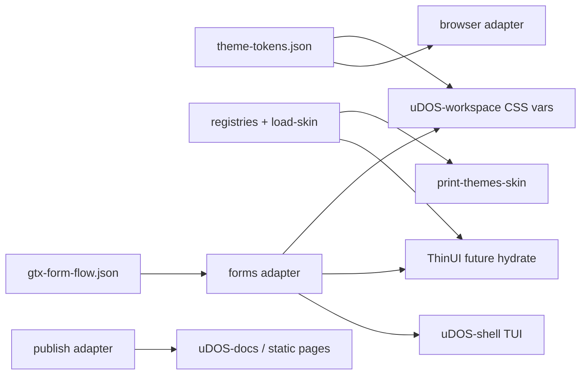

# Integration plan: ThinUI, workflow, Tailwind Prose, GTX forms

Cross-repo wiring for Workspace 06 exit criteria: one coherent story from tokens to operator surfaces.

## Current state (2026-04-01)

| Lane | Location | Status |
| --- | --- | --- |
| **ThinUI runtime** | `uDOS-thinui` `default-theme-resolver.ts` | Owns takeover frames; now accepts thinui-safe skin ids (`skin:<id>`, mirrored ids) while keeping runtime authority local. |
| **ThinUI ↔ themes** | `uDOS-thinui/docs/themes-sibling-bridge.md`, `scripts/print-themes-skin.mjs` | Documented boundary + diagnostic. |
| **Themes adapters** | `uDOS-themes/src/adapters/*` | Node `.mjs` implementations + smoke; ThinUI TS adapters under `src/adapters/thinui/`. |
| **Workflow** | `workflow-default` adapter + `gtx-step-task-map.json` | Text board prototype with explicit GTX step-id to workflow task-id mapping contract for Wizard/binder alignment. |
| **Tailwind Prose** | `publish-tailwind-prose` adapter + `tailwind-prose-preset.json` | Emits `prose` class strings + HTML and ships a shared machine-readable preset mirrored into workspace assets and into `packages/tailwind-prose-preset` for `file:` npm installs. |
| **GTX forms** | `examples/gtx-form-flow.json` + `forms` adapter | Canonical step flow + multi-surface renderers. |
| **Workspace web** | `browserDefaultShell.ts` + `theme-tokens.json` | CSS vars from JSON; sync script from themes repo. |

## Target architecture

## Integration steps (prioritised)

1. **ThinUI (phase C):** Optional import path: resolve `skin_id` → `loadSkinBundle` output → map `overrides.loader` to existing loader ids in resolver. No change to view loop ownership.
2. **Tailwind Prose:** Phase-E tranche 2 (post-O1): package path at `uDOS-themes/packages/tailwind-prose-preset` (sync via `scripts/sync-publish-prose-preset-to-package.sh`); workspace mirror unchanged (`sync-publish-prose-preset-to-workspace.sh`).
3. **Workflow:** Phase-D tranche 2 (post-O1): Wizard Surface UI mirrors `gtx-step-task-map.json` under `apps/surface-ui/src/lib/contracts/` (sync via `scripts/sync-gtx-step-task-map-to-wizard.sh`) and the workflow panel resolves the active `step_id` against that map for operator-visible task alignment.
4. **GTX in Shell:** **`scripts/demo-gtx-form-tui.mjs`** — run from `uDOS-themes` root: `node scripts/demo-gtx-form-tui.mjs` (defaults to **`examples/gtx-form-flow.json`**; `--step`, `--step-id`, `--json`, `--all`). Uses `renderTuiFormStep` from the forms adapter.

## Contracts not duplicated

- **GUI ownership:** `uDOS-dev/docs/gui-system-family-contract.md`
- **Display modes:** `docs/display-modes.md`

## Related

- `docs/step-form-presentation-rules.md`
- `docs/adapter-skin-registry-plan.md`
- `uDOS-workspace/apps/web/src/lib/theme/README.md`
